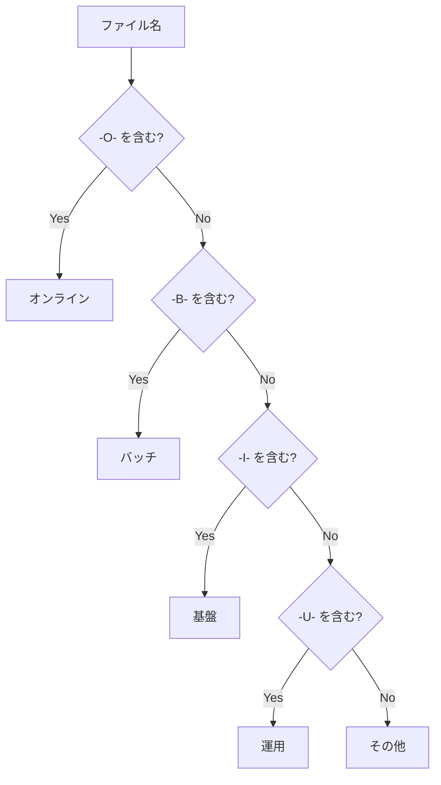
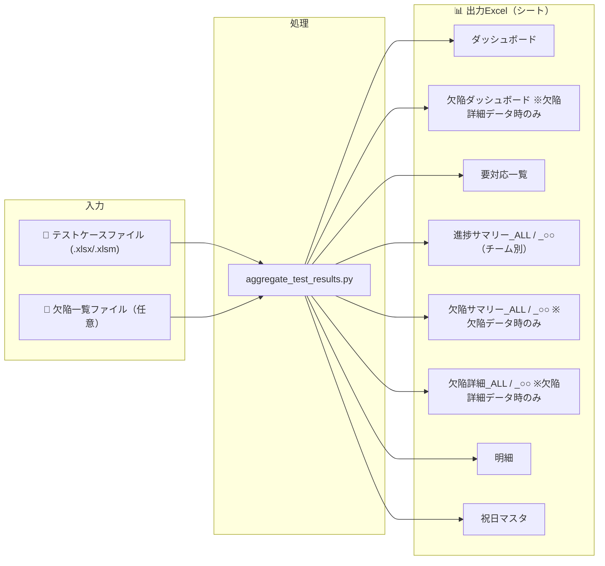
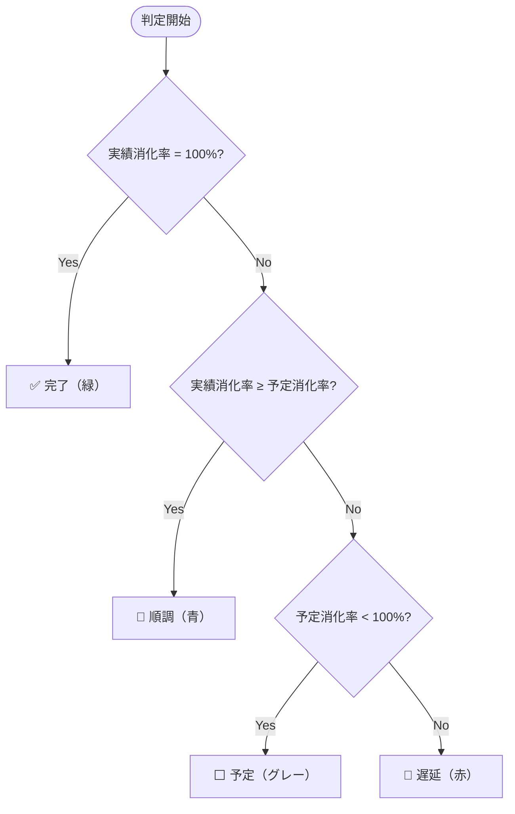

# テスト進捗集計ツール v4 マニュアル

## 目次

1. [概要](#概要)
2. [動作環境](#動作環境)
3. [セットアップ](#セットアップ)
4. [使い方](#使い方)
   - [GUIモード（ウィザード）](#guiモードウィザード)
   - [CLIモード](#cliモード)
5. [入力ファイルの仕様](#入力ファイルの仕様)
   - [テストケースファイル](#テストケースファイル)
   - [欠陥一覧ファイル](#欠陥一覧ファイル)
6. [出力ファイルの構成](#出力ファイルの構成)
   - [ダッシュボード](#ダッシュボード)
   - [欠陥ダッシュボード](#欠陥ダッシュボード)
   - [要対応一覧](#要対応一覧)
   - [進捗サマリー](#進捗サマリー)
   - [欠陥サマリー](#欠陥サマリー)
   - [欠陥詳細](#欠陥詳細)
   - [明細](#明細)
   - [祝日マスタ](#祝日マスタ)
7. [設定のカスタマイズ](#設定のカスタマイズ)
8. [EXE化（配布用）](#exe化配布用)
9. [トラブルシューティング](#トラブルシューティング)

---

## 概要

テスト進捗集計ツールは、複数のExcelファイルに分散したテストケースの予定・実績データを集計し、見やすいレポートを自動生成するツールです。

### 主な機能

| 機能 | 説明 |
|------|------|
| ダッシュボード | 本日の進捗サマリー、チーム別状況、推移チャート、欠陥状況 |
| 欠陥ダッシュボード | 欠陥の詳細分析（サマリー、対応状況別、緊急度別、業務機能分類、欠陥原因） |
| 要対応一覧 | 遅延しているテストケースの一覧 |
| 進捗サマリー | 日付×予定/実績の件数集計（チーム別シート） |
| 欠陥サマリー | 欠陥の検出・対応推移集計（全体＋チーム別シート） |
| 欠陥詳細 | 欠陥一覧の全レコード詳細（全体＋チーム別シート） |
| 明細シート | 全テストケースの詳細一覧 |
| 祝日マスタ | 営業日判定用の祝日管理 |

### 特徴

- ウィザード形式の使いやすいGUI
- チーム名自動識別（ファイル名パターンから判定）
- サブフォルダを含む再帰的なファイル収集
- 欠陥一覧ファイルの取り込みと集計（チーム別に指定可能）
- 欠陥詳細データ（テスト欠陥一覧シート）の読み取りと分析ダッシュボード
- 差分更新（キャッシュによる高速化）
- 条件付き書式による進捗の視覚化
- 累計・消化率の自動計算

---

## 動作環境

| 項目 | 要件 |
|------|------|
| OS | Windows 10/11, macOS, Linux |
| Python | 3.10 以上 |
| 依存ライブラリ | openpyxl |

---

## セットアップ

### 1. リポジトリのクローン

```bash
git clone https://github.com/your-repo/test-progress-collector.git
cd test-progress-collector
```

### 2. Python仮想環境の作成

#### macOS / Linux

```bash
# 仮想環境の作成
python3 -m venv .venv

# 仮想環境の有効化
source .venv/bin/activate

# 依存ライブラリのインストール
pip install -r requirements.txt
```

#### Windows (PowerShell)

```powershell
# 仮想環境の作成
python -m venv .venv

# 仮想環境の有効化
.venv\Scripts\Activate.ps1

# 依存ライブラリのインストール
pip install -r requirements.txt
```

#### Windows (コマンドプロンプト)

```cmd
REM 仮想環境の作成
python -m venv .venv

REM 仮想環境の有効化
.venv\Scripts\activate.bat

REM 依存ライブラリのインストール
pip install -r requirements.txt
```

---

## 使い方

### GUIモード（ウィザード）

引数なしで実行すると、ウィザード形式のGUIが起動します。

```bash
python aggregate_test_results.py
```

#### ウィザードの流れ


#### ステップ1/5: 対象フォルダ選択

<!-- 画像: ウィザード_ステップ1_フォルダ選択画面.png -->

- 「フォルダを選択」ボタンでテストケースExcelファイルが格納されたフォルダを選択
- 「サブフォルダも含める」にチェックを入れると、配下の全フォルダを再帰的に検索

#### ステップ2/5: 欠陥一覧ファイル選択

<!-- 画像: ウィザード_ステップ2_欠陥一覧ファイル選択画面.png -->

チーム別の欠陥一覧ファイルを選択します。**この手順は任意**です。欠陥データが不要な場合はスキップ（何も選択せずに「次へ」）できます。

- **オンライン**: オンラインチームの欠陥一覧ファイルを選択
- **バッチ**: バッチチームの欠陥一覧ファイルを選択
- **基盤**: 基盤チームの欠陥一覧ファイルを選択
- **運用**: 運用チームの欠陥一覧ファイルを選択

各チームの「ファイルを選択」ボタンを押してExcelファイルを指定します。選択後、ファイル名が表示されます。選択を取り消す場合は「クリア」ボタンを押してください。

> **ポイント**: 全チーム分を指定する必要はありません。集計が必要なチームのみ選択してください。

#### ステップ3/5: 週集計範囲

<!-- 画像: ウィザード_ステップ3_週範囲設定画面.png -->

- ダッシュボードの「週次」セクションで集計する期間を指定
- 空欄の場合は週次集計を行いません
- デフォルトで直近7日間が設定されています

**対応する日付形式:**
- `YYYY/MM/DD` （例: 2026/03/01）
- `YYYYMMDD` （例: 20260301）
- `YYYY-MM-DD` （例: 2026-03-01）

#### ステップ4/5: 出力設定

<!-- 画像: ウィザード_ステップ4_出力設定画面.png -->

- **新規作成**: 新しいExcelファイルを作成
- **既存ファイルを更新**: 既存ファイルを選択して上書き更新

#### ステップ5/5: 確認・実行

<!-- 画像: ウィザード_ステップ5_確認画面.png -->

- 設定内容を確認して「実行」をクリック
- 対象フォルダ、サブフォルダの有無、欠陥一覧ファイル（選択したチーム）、週範囲、出力先が一覧で表示されます

---

### CLIモード

コマンドライン引数を指定すると、GUIなしで実行できます。

#### 基本構文

```bash
python aggregate_test_results.py <入力フォルダ> [オプション]
```

#### オプション一覧

| オプション | 説明 | デフォルト |
|-----------|------|-----------|
| `<input_folder>` | テストケースExcelファイルが格納されたフォルダ | （必須） |
| `-o, --output` | 出力ファイルパス | `./output/テスト進捗集計_{日時}.xlsx` |
| `--no-subfolders` | サブフォルダを含めない | サブフォルダを含める |
| `--sheet-prefix` | 対象シートの接頭辞 | `ITB` |
| `--week-from` | 週集計の開始日 | なし |
| `--week-to` | 週集計の終了日 | なし |
| `--defect-online` | 欠陥一覧ファイルのパス（オンラインチーム） | なし |
| `--defect-batch` | 欠陥一覧ファイルのパス（バッチチーム） | なし |
| `--defect-infra` | 欠陥一覧ファイルのパス（基盤チーム） | なし |
| `--defect-ops` | 欠陥一覧ファイルのパス（運用チーム） | なし |

> **パスの指定**: `<input_folder>`、`-o`、`--defect-*` のすべてのパスは、**相対パス・絶対パスのどちらでも指定可能**です。
> - 相対パス例: `.\input\defects\欠陥一覧_オンライン.xlsx`
> - 絶対パス例: `C:\Projects\data\defects\欠陥一覧_オンライン.xlsx`

#### 使用例

##### macOS / Linux

```bash
# 基本的な使い方
python aggregate_test_results.py ./input -o ./output/report.xlsx

# サブフォルダを除外
python aggregate_test_results.py ./input -o ./output/report.xlsx --no-subfolders

# 週範囲を指定（スラッシュ形式）
python aggregate_test_results.py ./input -o ./output/report.xlsx \
    --week-from 2026/03/01 --week-to 2026/03/07

# 欠陥一覧ファイルを指定（必要なチームのみ）
python aggregate_test_results.py ./input -o ./output/report.xlsx \
    --defect-online ./input/defects/欠陥一覧_オンライン.xlsx \
    --defect-batch ./input/defects/欠陥一覧_バッチ.xlsx \
    --defect-infra ./input/defects/欠陥一覧_基盤.xlsx \
    --defect-ops ./input/defects/欠陥一覧_運用.xlsx

# 全オプション指定の例
python aggregate_test_results.py ./input -o ./output/report.xlsx \
    --week-from 2026/03/01 --week-to 2026/03/07 \
    --defect-online ./input/defects/欠陥一覧_オンライン.xlsx \
    --defect-batch ./input/defects/欠陥一覧_バッチ.xlsx
```

##### Windows (PowerShell / コマンドプロンプト)

```powershell
# 基本的な使い方
python aggregate_test_results.py .\input -o .\output\report.xlsx

# サブフォルダを除外
python aggregate_test_results.py .\input -o .\output\report.xlsx --no-subfolders

# 週範囲を指定
python aggregate_test_results.py .\input -o .\output\report.xlsx --week-from 2026/03/01 --week-to 2026/03/07

# 欠陥一覧ファイルを指定
python aggregate_test_results.py .\input -o .\output\report.xlsx `
    --defect-online .\input\defects\欠陥一覧_オンライン.xlsx `
    --defect-batch .\input\defects\欠陥一覧_バッチ.xlsx `
    --defect-infra .\input\defects\欠陥一覧_基盤.xlsx `
    --defect-ops .\input\defects\欠陥一覧_運用.xlsx

# EXEの場合も同様（相対パス・絶対パスどちらも使用可能）
.\aggregate_test_results.exe .\input -o .\output\report.xlsx `
    --defect-online C:\data\defects\欠陥一覧_オンライン.xlsx `
    --defect-batch .\input\defects\欠陥一覧_バッチ.xlsx
```

---

## 入力ファイルの仕様

### テストケースファイル

#### 対象ファイル

| 項目 | 仕様 |
|------|------|
| ファイル形式 | `.xlsx`, `.xlsm` |
| 対象シート | シート名が `ITB` で始まるシートのみ |
| 除外ファイル | `~$` で始まる一時ファイルは自動除外 |

#### 必須列

入力Excelファイルの各シートは以下の列構成が必要です。

| 列 | 内容 | 備考 |
|----|------|------|
| C列 (3列目) | テストID | 空欄の行はスキップ |
| Q列 (17列目) | 実施者_予定日 | 日付形式 |
| R列 (18列目) | 実施者_実績日 | 日付形式 |
| S列 (19列目) | 検証者_予定日 | 日付形式 |
| T列 (20列目) | 検証者_実績日 | 日付形式 |

**データ開始行**: 19行目から読み取り開始

#### チーム名の自動識別

**ファイル名**に含まれるパターンでチーム名を自動判定します。

| パターン | チーム名 |
|----------|----------|
| `-O-` | オンライン |
| `-B-` | バッチ |
| `-I-` | 基盤 |
| `-U-` | 運用 |
| （上記以外） | その他 |



**例:**
- `ITB-O-001_ログイン機能.xlsx` → **オンライン**
- `ITB-B-002_夜間バッチ.xlsx` → **バッチ**
- `テストケース一覧.xlsx` → **その他**

> **注意**: シート名やテストIDではなく、**ファイル名**で判定します。

---

### 欠陥一覧ファイル

チーム別の欠陥一覧ファイルを指定することで、欠陥の検出・対応推移をレポートに含めることができます。欠陥ファイルの指定は**任意**です。

#### ファイル要件

| 項目 | 仕様 |
|------|------|
| ファイル形式 | `.xlsx` |
| 必須シート名 | `欠陥発見・対応推移集計表`（完全一致） |
| ヘッダー行 | 10行目 |
| データ開始行 | 11行目 |

#### 必須列構成（欠陥発見・対応推移集計表）

| 列 | 内容 | 備考 |
|----|------|------|
| B列 (2列目) | No. | 連番 |
| C列 (3列目) | 日付 | 日付形式 |
| D列 (4列目) | 検出欠陥数 | 当日の検出件数 |
| E列 (5列目) | 対応欠陥数 | 当日の対応件数 |
| F列 (6列目) | 累積検出欠陥数 | 検出の累計 |
| G列 (7列目) | 累積対応欠陥数 | 対応の累計 |
| H列 (8列目) | 累積未対応欠陥数 | 未対応の累計 |

#### テスト欠陥一覧シート（任意）

欠陥ダッシュボード・欠陥詳細シートを出力するには、同じ欠陥一覧ファイル内に `テスト欠陥一覧` シートが必要です。このシートがない場合、欠陥サマリーのみ出力されます。

| 項目 | 仕様 |
|------|------|
| シート名 | `テスト欠陥一覧`（完全一致） |
| ヘッダー行 | 8行目 |
| データ開始行 | 9行目 |
| 集計フラグ | AP列（42列目）: 1=欠陥として集計、0=非欠陥として除外 |

#### 主な列構成（テスト欠陥一覧）

| 列 | 内容 | 備考 |
|----|------|------|
| A列 (1列目) | 欠陥ID | 一意の識別子 |
| B列 (2列目) | 対応状況 | 例: 01:未着手, 02:調査中, 03:対応中, 04:検証中, 05:完了, 98:保留, 99:対応無し |
| C列 (3列目) | 件名 | 欠陥の概要 |
| D列 (4列目) | 発見日 | 日付形式 |
| G列 (7列目) | 業務機能分類 | 業務機能の分類名 |
| M列 (13列目) | 緊急度 | 高/中/低 |
| N列 (14列目) | 影響度 | 高/中/低 |
| O列 (15列目) | 調査予定日 | 日付形式 |
| P列 (16列目) | 調査完了日 | 日付形式 |
| T列 (20列目) | 欠陥原因（深層） | 原因分類 |
| U列 (21列目) | 欠陥埋込フェーズ | RD/ED/ID/PD等 |
| V列 (22列目) | 検出すべきフェーズ | CT/ITa/ITb/ST等 |
| AC列 (29列目) | 対応予定日 | 日付形式 |
| AD列 (30列目) | 対応日 | 日付形式 |
| AF列 (32列目) | 横展開有無 | 有/無 |
| AG列 (33列目) | 横展開先 | テキスト |
| AH列 (34列目) | 横展開完了予定日 | 日付形式 |
| AI列 (35列目) | 横展開完了日 | 日付形式 |
| AK列 (37列目) | リリース予定日 | 日付形式 |
| AL列 (38列目) | リリース日 | 日付形式 |
| AM列 (39列目) | 検証日 | 日付形式 |
| AP列 (42列目) | 集計フラグ | 1=欠陥, 0=非欠陥（99:対応無し等） |

#### チームとCLIオプションの対応

| チーム | CLIオプション | ファイル名例 |
|--------|--------------|-------------|
| オンライン | `--defect-online` | `欠陥一覧_オンライン.xlsx` |
| バッチ | `--defect-batch` | `欠陥一覧_バッチ.xlsx` |
| 基盤 | `--defect-infra` | `欠陥一覧_基盤.xlsx` |
| 運用 | `--defect-ops` | `欠陥一覧_運用.xlsx` |

#### 推奨フォルダ構成

```
input/
├── defects/                          ← 欠陥一覧ファイル格納フォルダ
│   ├── 欠陥一覧_オンライン.xlsx
│   ├── 欠陥一覧_バッチ.xlsx
│   ├── 欠陥一覧_基盤.xlsx
│   └── 欠陥一覧_運用.xlsx
├── オンライン/                        ← テストケースファイル
│   ├── ITB-EV001-SC001-O-001.xlsx
│   └── ...
├── バッチ/
│   └── ...
├── 基盤/
│   └── ...
└── 運用/
    └── ...
```

> **ポイント**: 欠陥一覧ファイルはテストケースファイルとは別のフォルダに配置してください。テストケースと同じフォルダに入れると、テストケースとして誤読される可能性はありませんが、管理上分けておくことを推奨します。

---

## 出力ファイルの構成



出力されるExcelファイルは以下のシート構成になります。

| シート名 | 内容 | 備考 |
|----------|------|------|
| ダッシュボード | 本日の進捗サマリー、チャート、欠陥状況 | |
| 欠陥ダッシュボード | 欠陥の詳細分析ダッシュボード | 欠陥詳細データ指定時のみ |
| 要対応一覧 | 遅延テストケース一覧 | |
| 進捗サマリー_ALL | 全体の日次進捗 | |
| 進捗サマリー_○○ | チーム別の日次進捗 | |
| 欠陥サマリー_ALL | 全体の欠陥検出・対応推移 | 欠陥データ指定時のみ |
| 欠陥サマリー_○○ | チーム別の欠陥検出・対応推移 | 欠陥データ指定時のみ |
| 欠陥詳細_ALL | 全チームの欠陥詳細一覧 | 欠陥詳細データ指定時のみ |
| 欠陥詳細_○○ | チーム別の欠陥詳細一覧 | 欠陥詳細データ指定時のみ |
| 明細 | 全テストケースの詳細 | |
| 祝日マスタ | 祝日一覧（編集可能） | |

---

### ダッシュボード

<!-- 画像: 出力Excel_ダッシュボード.png -->

プロジェクト全体の状況を一目で把握できるシートです。

#### 構成要素

1. **基準日**: 進捗判定の基準となる日付（デフォルト: 今日）。セルB2に配置され、ユーザーが手動で変更可能。欠陥ダッシュボードの「新規検出」や各種予定超過判定もこの基準日を参照する。
2. **週範囲**: 週次集計の対象期間（セルG2: From、セルI2: To）。実施・検証の週次集計、および欠陥ダッシュボードの「週検出」で使用される。

3. **実施セクション**（青系）
   - 日次: 当日の予定・実績
   - 週次: 指定期間の予定・実績・残数・遅延
   - 総計: 総数・累計・消化率・状態

4. **検証セクション**（緑系）
   - 実施セクションと同様の構成

5. **欠陥セクション**（欠陥データ指定時のみ表示）
   - 週次検出数: 指定期間中に検出された欠陥の件数
   - 累積検出数: 検出欠陥の累計
   - 累積対応数: 対応済み欠陥の累計
   - 累積未対応数: 未対応欠陥の累計

6. **進捗推移チャート**
   - チーム別の累計推移グラフ
   - 予定線と実績線の比較

#### 進捗状態の判定

| 状態 | 条件 | 色 |
|------|------|-----|
| 完了 | 実績消化率 = 100% | 緑 |
| 順調 | 実績消化率 ≥ 予定消化率 | 青 |
| 遅延 | 実績消化率 < 予定消化率 | 赤 |
| 予定 | 予定消化率 < 100% | グレー |



---

### 要対応一覧

遅延しているテストケースの一覧です。優先的に対応が必要な項目を確認できます。

#### 表示条件

- 実施予定日が基準日以前で、実施実績がないもの
- 検証予定日が基準日以前で、検証実績がないもの

---

### 進捗サマリー

日付ごとの予定・実績件数を集計したシートです。

#### シート種類

- **進捗サマリー_ALL**: 全チーム合計
- **進捗サマリー_オンライン**: オンラインチームのみ
- **進捗サマリー_バッチ**: バッチチームのみ
- など（チーム別に自動生成）

#### 列構成

| グループ | 列 | 内容 |
|----------|-----|------|
| 共通 | 日付 | 対象日付 |
| 共通 | 曜 | 曜日 |
| 共通 | 区分 | 営業日/土日祝 |
| 実施 | 予定 | 実施予定件数 |
| 実施 | 実績 | 実施実績件数 |
| 実施 | 残 | 未実施件数 |
| 実施 | 累計予定 | 予定の累計 |
| 実施 | 累計実績 | 実績の累計 |
| 実施 | 消化率 | 累計実績/累計予定 |
| 実施 | 状態 | 順調/遅延/完了 |
| 検証 | （実施と同様） | |
| 合計 | 残数 | 実施残+検証残 |
| 合計 | 消化率 | 総合消化率 |

---

### 欠陥サマリー

<!-- 画像: 出力Excel_欠陥サマリー.png -->

欠陥の検出・対応推移を日付ごとに集計したシートです。**欠陥一覧ファイルを指定した場合にのみ生成されます。**

#### シート種類

- **欠陥サマリー_ALL**: 全チームの欠陥を合算した推移
- **欠陥サマリー_オンライン**: オンラインチームのみ
- **欠陥サマリー_バッチ**: バッチチームのみ
- など（指定したチーム別に自動生成）

#### 列構成

| 列 | 内容 |
|----|------|
| 日付 | 対象日付 |
| 曜日 | 曜日（月〜日） |
| 検出欠陥数 | 当日の検出件数 |
| 対応欠陥数 | 当日の対応件数 |
| 累積検出欠陥数 | 検出の累計 |
| 累積対応欠陥数 | 対応の累計 |
| 累積未対応欠陥数 | 未対応の累計（累積検出 - 累積対応） |

#### 表示仕様

- ヘッダー行: 4行目
- データ開始行: 5行目
- 土日・祝日の行はグレー背景で表示
- ALLシートでは各チームの累積値を日付ごとに合算して再計算

---

### 欠陥ダッシュボード

欠陥一覧ファイルに「テスト欠陥一覧」シートが含まれている場合に生成される、欠陥の詳細分析ダッシュボードです。COUNTIFS数式により欠陥詳細シートのデータを参照して集計します。

#### 構成セクション

| セクション | 内容 |
|-----------|------|
| 1. 欠陥サマリー | チーム別の未完了・予定超過(調査/対応/横展開/検証)・滞留7日超(同) |
| 2. 対応状況別欠陥数 | チーム別×対応状況の件数、新規検出・週検出・累積検出 |
| 3. 緊急度別欠陥数 | チーム別×緊急度の件数 |
| 4. 業務機能分類 | チーム別×業務機能分類の件数＋円グラフ |
| 5. 欠陥原因（深層） | チーム別×欠陥原因の件数＋円グラフ |

#### セクション1: 欠陥サマリーの集計条件

すべての項目で、該当する完了日が入力済みの場合はカウントしません。

| 項目 | カテゴリ | 条件 |
|------|---------|------|
| 未完了 | - | 検証日(AM列)が空のレコード |
| 調査 | 予定超過 | 調査予定日 < 基準日 かつ 調査完了日が空 |
| 対応 | 予定超過 | 対応予定日 < 基準日 かつ 対応日が空 |
| 横展開 | 予定超過 | 横展開有 かつ 横展開完了予定日 < 基準日 かつ 横展開完了日が空 |
| 検証 | 予定超過 | リリース予定日 < 基準日 かつ 検証日が空 |
| 合計 | 予定超過 | 上記4項目の合計 |
| 調査 | 滞留(7日超) | 調査予定日 < 基準日-7日 かつ 調査完了日が空 |
| 対応 | 滞留(7日超) | 対応予定日 < 基準日-7日 かつ 対応日が空 |
| 横展開 | 滞留(7日超) | 横展開有 かつ 横展開完了予定日 < 基準日-7日 かつ 横展開完了日が空 |
| 検証 | 滞留(7日超) | リリース予定日 < 基準日-7日 かつ 検証日が空 |
| 合計 | 滞留(7日超) | 上記4項目の合計 |

#### セクション2: 検出状況の参照

- **新規検出**: 前営業日〜基準日の間に発見された欠陥数
  - 前営業日はExcelの `WORKDAY(基準日, -1, 祝日マスタ)` 関数で算出
  - 土日および祝日マスタに登録された祝祭日を除いた直近の営業日が起点となる
  - 例: 基準日が月曜(1/19)の場合、前営業日は金曜(1/16)となり、1/16〜1/19の発見分をカウント
  - 例: 基準日が月曜で、前の金曜が祝日の場合、木曜が前営業日となる
- **週検出**: ダッシュボードシートの週範囲（From〜To）の期間内に発見された欠陥数
  - ダッシュボードシートの「週範囲From」(G2)〜「週範囲To」(I2)のセル値を参照
  - 週範囲が未設定の場合は0件となる
- **累積検出**: チームの全レコード数（AP列=1の全欠陥）

#### 円グラフ

セクション4（業務機能分類）とセクション5（欠陥原因）では、チーム別の円グラフが自動生成されます。0%のカテゴリは非表示となります。

---

### 欠陥詳細

欠陥一覧ファイルの「テスト欠陥一覧」シートから読み取った全レコードの詳細一覧です。**テスト欠陥一覧シートが含まれている場合にのみ生成されます。**

#### シート種類

- **欠陥詳細_ALL**: 全チームの欠陥詳細を統合した一覧
- **欠陥詳細_オンライン**: オンラインチームのみ
- **欠陥詳細_バッチ**: バッチチームのみ
- など（指定したチーム別に自動生成）

#### 表示内容

テスト欠陥一覧シートの各列（欠陥ID、対応状況、件名、発見日、業務機能分類、緊急度、影響度、各予定日・完了日、欠陥原因など）がそのまま出力されます。AP列の集計フラグが1のレコードのみ対象です。

---

### 明細

全テストケースの詳細情報を記録したシートです。

#### 列構成

| 列 | 内容 |
|----|------|
| No. | 連番 |
| ファイル名 | 元ファイルのパス |
| シート名 | 元シート名 |
| チーム名 | 自動判定されたチーム |
| テストID | テストケースID |
| 実施予定 | 実施予定日 |
| 実施実績 | 実施実績日 |
| 実施状態 | 完了/遅延/予定/－ |
| 検証予定 | 検証予定日 |
| 検証実績 | 検証実績日 |
| 検証状態 | 完了/遅延/予定/－ |
| 基準日 | ダッシュボードの基準日参照 |

---

### 祝日マスタ

営業日判定に使用する祝日一覧です。

#### 初期登録データ

- 日本の祝日（2024年〜2030年）
- 年末年始休暇（12/30〜1/3）

#### カスタマイズ

出力後のExcelファイルで直接編集できます。
- A列: 日付（YYYY/MM/DD形式）
- B列: 祝日名

---

## 設定のカスタマイズ

スクリプト冒頭の設定セクションを編集することで、動作をカスタマイズできます。

### 対象シートの接頭辞

```python
SHEET_PREFIX = "ITB"  # このプレフィックスで始まるシートのみ対象
```

### データ列の位置

```python
COL_TEST_ID = 3        # C列: テストID
COL_JISSHI_YOTEI = 17  # Q列: 実施者 予定
COL_JISSHI_JISSEKI = 18 # R列: 実施者 実績
COL_KENSHO_YOTEI = 19  # S列: 検証者 予定
COL_KENSHO_JISSEKI = 20 # T列: 検証者 実績
DATA_START_ROW = 19    # データ開始行
```

### チーム識別パターン

```python
TEAM_PATTERNS = {
    "-O-": "オンライン",
    "-B-": "バッチ",
    "-I-": "基盤",
    "-U-": "運用",
}
```

---

## EXE化（配布用）

PyInstallerを使用してスタンドアロンのEXEファイルを作成できます。

### 1. PyInstallerのインストール

```bash
pip install pyinstaller
```

### 2. EXEの作成

```powershell
# 基本（コンソール付き）
pyinstaller --onefile aggregate_test_results.py

# GUIアプリとして（コンソール非表示）- 推奨
pyinstaller --onefile --windowed aggregate_test_results.py

# アイコン付き
pyinstaller --onefile --windowed --icon=app.ico aggregate_test_results.py
```

### 3. 出力先

`dist\aggregate_test_results.exe` にEXEファイルが生成されます。

### 注意事項

- `--windowed`オプションでコンソールウィンドウを非表示にできます
- tkinterは標準ライブラリのため追加設定不要
- 初回起動時はWindows Defenderの警告が出る場合があります

---

## トラブルシューティング

### よくある問題と解決方法

#### Q: 「対象シートなし」と表示されてスキップされる

**原因**: シート名が `ITB` で始まっていない

**解決方法**:
- 入力Excelのシート名を確認
- または `SHEET_PREFIX` 設定を変更

---

#### Q: チーム名が「その他」になってしまう

**原因**: ファイル名にチーム識別パターン（`-O-`, `-B-`, `-I-`, `-U-`）が含まれていない

**解決方法**:
- ファイル名を変更（例: `テスト.xlsx` → `ITB-O-001_テスト.xlsx`）
- または `TEAM_PATTERNS` に新しいパターンを追加

---

#### Q: 日付が正しく読み取れない

**原因**: Excelのセルが文字列形式になっている

**解決方法**:
- 入力Excelの日付列を日付形式に変更
- セルの書式設定で「日付」を選択

---

#### Q: 出力ファイルが開けない

**原因**: 出力先のExcelファイルが開いたまま

**解決方法**:
- 出力先のExcelファイルを閉じてから再実行

---

#### Q: 欠陥サマリーシートが出力されない

**原因**: 欠陥一覧ファイルが指定されていない、またはファイルが見つからない

**解決方法**:
- GUIモード: ステップ2で欠陥一覧ファイルを選択しているか確認
- CLIモード: `--defect-online` 等のオプションで正しいパスを指定しているか確認
- 指定したファイルが存在し、アクセス可能であることを確認

---

#### Q: 欠陥一覧ファイルの読み取りでエラーが出る

**原因**: シート名が「欠陥発見・対応推移集計表」と一致していない、または列構成が異なる

**解決方法**:
- シート名が完全一致しているか確認（スペースや全角半角に注意）
- B〜H列の構成が仕様どおりか確認
- データが11行目から始まっているか確認

---

#### Q: 処理が遅い

**解決方法**:
- 2回目以降の実行ではキャッシュが効くため高速化されます
- 変更のないファイルは自動的にスキップされます

---

## 付録: 出力サンプル

### コンソール出力例

```
================================================================================
  テスト進捗集計ツール v4
================================================================================

[1] データ収集中...
  📁 入力フォルダ: ./input
  ✅ 欠陥一覧(オンライン): 45件
  ✅ 欠陥一覧(バッチ): 32件
  📄 ITB-O-001_ログイン機能.xlsx
     ✅ ITB001 (25件) [チーム: オンライン]
     ✅ ITB002 (18件) [チーム: オンライン]
  📄 ITB-B-002_夜間バッチ.xlsx
     ✅ ITB001 (42件) [チーム: バッチ]
  ⏭ ITB-I-003_基盤.xlsx (キャッシュ使用: 30件)

  処理完了: 2ファイル処理, 1ファイルスキップ, 3シート, 115レコード

[2] Excel出力中...

  ✅ 出力完了: ./output/report.xlsx
     ダッシュボード: 本日のサマリー
     明細シート: 115件
     サマリーシート: ALL + 3チーム
     欠陥サマリー: ALL + 2チーム

================================================================================
  完了しました
================================================================================
```

---

## 更新履歴

| バージョン | 日付 | 内容 |
|-----------|------|------|
| v4.0 | 2026/03/05 | 初版リリース |
| v4.1 | 2026/03/10 | 欠陥管理機能を追加（欠陥一覧ファイル取り込み、欠陥サマリーシート出力、ダッシュボード欠陥セクション） |
| v4.2 | 2026/03/10 | 欠陥ダッシュボード・欠陥詳細シートを追加（テスト欠陥一覧シート対応、5セクション分析、円グラフ） |

---

---

## 画像配置ガイド

本ドキュメントに挿入する画像の一覧です。スクリーンショットを撮影し、`<!-- 画像: ... -->` の箇所に配置してください。

| No. | ファイル名 | 撮影内容 |
|-----|-----------|----------|
| 1 | ウィザード_ステップ1_フォルダ選択画面.png | ステップ1: フォルダ選択画面（フォルダパスとサブフォルダチェックボックスが見える状態） |
| 2 | ウィザード_ステップ2_欠陥一覧ファイル選択画面.png | ステップ2: 欠陥一覧ファイル選択画面（4チーム分のファイル選択ボタンが見える状態） |
| 3 | ウィザード_ステップ3_週範囲設定画面.png | ステップ3: 週範囲設定画面（開始日・終了日の入力フィールドが見える状態） |
| 4 | ウィザード_ステップ4_出力設定画面.png | ステップ4: 出力設定画面（新規作成/既存ファイル更新の選択が見える状態） |
| 5 | ウィザード_ステップ5_確認画面.png | ステップ5: 確認画面（全設定内容の一覧と実行ボタンが見える状態） |
| 6 | 出力Excel_ダッシュボード.png | ダッシュボードシート全体（進捗サマリー＋チャート＋欠陥セクション） |
| 7 | 出力Excel_欠陥サマリー.png | 欠陥サマリーシート（日付ごとの検出・対応推移テーブル） |
| 8 | 出力Excel_進捗サマリー.png | 進捗サマリーシート（日付ごとの予定・実績テーブル） |

---

## ライセンス

MIT License

## 作成者

テスト進捗集計ツール開発チーム
