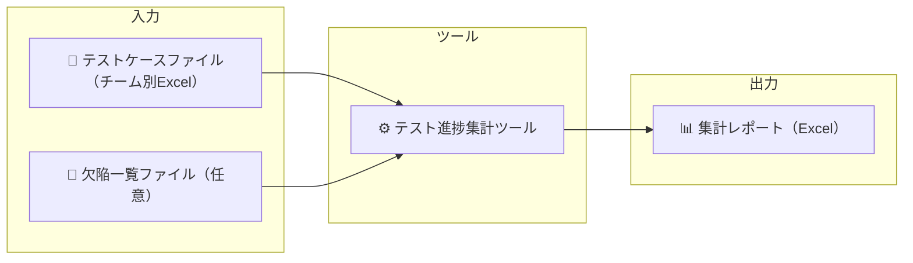

# テスト進捗集計ツール v4 — 機能概要

> このツールでできることを簡単にまとめた紹介資料です。

---

## このツールでできること

複数のExcelファイルに分散したテスト結果を**自動で集計**し、進捗レポートをワンクリックで生成します。



---

## 主な機能

### 1. 進捗ダッシュボード

プロジェクト全体の状況を1枚のシートで把握できます。

<!-- 画像: 機能概要_ダッシュボード.png -->

- 本日・週次・総計の実施／検証件数を表示
- 実績 vs 予定を比較し、進捗状態（完了 / 順調 / 遅延）を色で表示
- チーム別の累計推移グラフ
- 欠陥の検出・対応数サマリー（欠陥データ指定時）

---

### 2. 欠陥ダッシュボード

欠陥の詳細分析を5つの切り口で可視化します。（欠陥詳細データ指定時のみ）

<!-- 画像: 機能概要_欠陥ダッシュボード.png -->

| セクション | 内容 |
|-----------|------|
| 欠陥サマリー | チーム別の未完了・予定超過・滞留件数 |
| 対応状況別 | 未着手 / 調査中 / 対応中 / 完了 などの件数内訳 |
| 緊急度別 | 高 / 中 / 低 の件数内訳 |
| 業務機能分類 | 機能ごとの欠陥件数と円グラフ |
| 欠陥原因 | 深層原因ごとの件数と円グラフ |

---

### 3. 要対応一覧

予定日を過ぎても未完了のテストケースを自動で抽出します。

<!-- 画像: 機能概要_要対応一覧.png -->

- 実施予定日超過 / 検証予定日超過の両方を検出
- 毎朝の朝会で「今日対応すべき項目」をすぐ確認できます

---

### 4. 進捗サマリー

日付ごとの予定・実績件数を集計したシートです。

<!-- 画像: 機能概要_進捗サマリー.png -->

- 全体（ALL）+ チーム別シートを自動生成
- 累計・消化率・状態を自動計算
- 土日・祝日はグレー表示

---

### 5. 欠陥サマリー / 欠陥詳細

欠陥の検出・対応推移と全レコードの詳細一覧を出力します。（欠陥データ指定時のみ）

<!-- 画像: 機能概要_欠陥サマリー.png -->

- 欠陥サマリー: 日付ごとの検出・対応・未対応件数の推移
- 欠陥詳細: 全欠陥レコードの詳細一覧（全体 + チーム別）

---

## 使い方

### GUIモード（ウィザード形式）

引数なしで起動すると、5ステップのウィザードが表示されます。

<!-- 画像: 機能概要_ウィザード起動画面.png -->


```bash
python aggregate_test_results.py
# または
aggregate_test_results.exe
```

### CLIモード（自動化・定期実行）

コマンドライン引数を指定するとGUIなしで実行できます。タスクスケジューラと組み合わせて**毎朝自動生成**することも可能です。

<!-- 画像: 機能概要_CLI実行結果.png -->

```bash
aggregate_test_results.exe .\input -o .\output\report.xlsx ^
    --defect-online .\input\defects\欠陥一覧_オンライン.xlsx ^
    --defect-batch  .\input\defects\欠陥一覧_バッチ.xlsx
```

---

## 画像配置ガイド

| No. | ファイル名 | 撮影内容 |
|-----|-----------|----------|
| 1 | 機能概要_ダッシュボード.png | ダッシュボードシート全体（進捗サマリー＋チャート＋欠陥セクション） |
| 2 | 機能概要_欠陥ダッシュボード.png | 欠陥ダッシュボードシート全体（5セクション） |
| 3 | 機能概要_要対応一覧.png | 要対応一覧シート（遅延テストケースの一覧） |
| 4 | 機能概要_進捗サマリー.png | 進捗サマリーシート（日付ごとの予定・実績テーブル） |
| 5 | 機能概要_欠陥サマリー.png | 欠陥サマリーシート（日付ごとの検出・対応推移テーブル） |
| 6 | 機能概要_ウィザード起動画面.png | GUIウィザードの初期画面（ステップ1: フォルダ選択） |
| 7 | 機能概要_CLI実行結果.png | コマンドプロンプトでの実行結果（完了メッセージが見える状態） |
